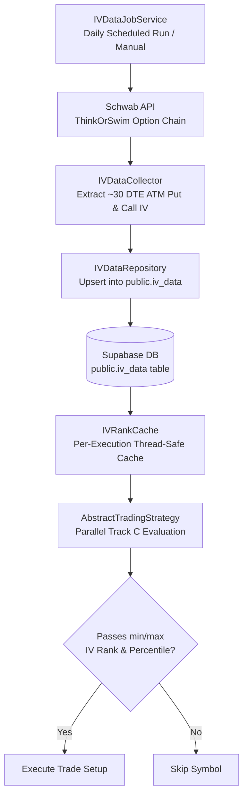

# Implied Volatility (IV) & Volatility Metrics Documentation

This document provides a detailed technical specification of how **IV Percentile**, **IV Rank**, and all other volatility-related indicators are gathered, computed, cached, and utilized across the trading bot.

---

## 1. Architectural Overview & Ingestion Pipeline

To compute IV Rank and IV Percentile without incurring heavy real-time option chain overhead during strategy execution, the bot maintains a historical daily timeseries of 30-day At-The-Money (ATM) Implied Volatility in Supabase (`public.iv_data`).

### Data Ingestion Flow



### Collection Mechanics ([IVDataCollector.java](file:///c:/Projects/trading-bot/src/main/java/com/hemasundar/services/IVDataCollector.java))

1. **Option Chain Retrieval**: Calls `ThinkOrSwimAPIs.getOptionChain(symbol)`.
2. **Expiry Selection**: Finds the expiration cycle closest to 30 DTE:
   - Target: `TARGET_DTE = 30`, with a search window of `[0, 60]` DTE (`DTE_TOLERANCE = 30`).
3. **ATM Strike Selection**: Locates the strike price minimizing absolute distance to current underlying price:
   $$\text{ATM Strike} = \arg\min_{\text{strike}} |\text{strike} - \text{underlyingPrice}|$$
4. **IV Extraction & Normalization**:
   - Reads the option contract volatility (`option.getVolatility()`).
   - Normalizes decimal values ($< 5.0$) to percentage form ($\times 100$).
   - Captures both `atmPutIV` and `atmCallIV`.
5. **Timestamping**: Converts the option quote millisecond timestamp into a `LocalDate` (market date) rather than local system date to preserve accurate trading session alignment.
6. **Supabase Upsert**: Saves records via [IVDataRepository.java](file:///c:/Projects/trading-bot/src/main/java/com/hemasundar/services/supabase/IVDataRepository.java) using PostgreSQL `ON CONFLICT (symbol, date) DO UPDATE`.

---

## 2. How IV Percentile Is Calculated

**IV Percentile** measures the percentage of historical trading days over the past 1 year where the asset's implied volatility was **lower** than today's implied volatility.

### Implementation Details ([IVDataRepository.java:L145-L177](file:///c:/Projects/trading-bot/src/main/java/com/hemasundar/services/supabase/IVDataRepository.java#L145-L177))

#### Step 1: Historical Data Fetch
Fetches up to 1 year of historical daily IV records from Supabase:
```sql
SELECT date, put_iv, call_iv 
FROM public.iv_data 
WHERE symbol = :symbol 
  AND date >= CURRENT_DATE - INTERVAL '1 year' 
ORDER BY date DESC;
```

#### Step 2: Minimum Record Threshold (Fail-Open)
A minimum of **20 historical trading records** (~1 trading month) is required:
```java
if (rows == null || rows.size() < MIN_RECORDS_REQUIRED) { // MIN_RECORDS_REQUIRED = 20
    return null; // Returns null to fail-open (trade is permitted)
}
```

#### Step 3: Daily Average IV Normalization
Each historical row and the current day's row are converted into a blended average IV:
$$\text{avgIV}(\text{row}) = \begin{cases} 
\frac{\text{put\_iv} + \text{call\_iv}}{2.0}, & \text{if both present} \\
\text{put\_iv}, & \text{if call\_iv is null} \\
\text{call\_iv}, & \text{if put\_iv is null} \\
0.0, & \text{if both are null}
\end{cases}$$

Current IV is defined as the most recent day's blended average:
$$\text{currentIV} = \text{avgIV}(\text{rows}[0])$$

#### Step 4: Frequency Count & Percentile Calculation
The system counts the number of historical days where average IV was strictly less than `currentIV`:
$$\text{daysBelow} = \sum_{i=0}^{N-1} \mathbf{1}_{[\text{avgIV}(\text{rows}[i]) < \text{currentIV}]}$$

$$\text{IV Percentile} = \left( \frac{\text{daysBelow}}{N} \right) \times 100.0$$

Where $N = \text{rows.size()}$ (total available records in the 1-year lookback).

### Code in [IVDataRepository.java](file:///c:/Projects/trading-bot/src/main/java/com/hemasundar/services/supabase/IVDataRepository.java):
```java
public Double getIVPercentile(String symbol) throws IOException {
    List<Map<String, Object>> rows = fetchIVRows(symbol);
    if (rows == null) return null;

    double currentIV = toAvgIV(rows.get(0), symbol);
    long daysBelow = rows.stream()
            .filter(row -> toAvgIV(row, symbol) < currentIV)
            .count();

    double ivPercentile = (double) daysBelow / rows.size() * 100.0;
    return ivPercentile;
}
```

### Numerical Example
Suppose an asset has $N = 250$ trading days of IV data over the past year:
- Today's Average IV: `32.0%`
- Days where historical average IV was $< 32.0\%$: `175 days`
$$\text{IV Percentile} = \frac{175}{250} \times 100.0 = 70.0\%$$
*(Meaning today's IV is higher than 70% of days in the past year).*

---

## 3. Other IV & Volatility Indicators Calculated in the Project

The system calculates several complementary volatility metrics:

### 1. IV Rank (Implied Volatility Rank)
- **Purpose**: Measures where current IV sits relative to its absolute 52-week High and Low extremes.
- **Code**: [IVDataRepository.java:L100-L142](file:///c:/Projects/trading-bot/src/main/java/com/hemasundar/services/supabase/IVDataRepository.java#L100-L142)
- **Formula**:
  $$\text{IV Rank} = \frac{\text{currentIV} - \text{minIV}}{\text{maxIV} - \text{minIV}} \times 100.0$$
  - $\text{minIV} = \min_{i}(\text{avgIV}_i)$ over the 1-year lookback.
  - $\text{maxIV} = \max_{i}(\text{avgIV}_i)$ over the 1-year lookback.
  - Edge case: If $\text{maxIV} == \text{minIV}$, returns `0.0`.
  - Fail-open: Returns `null` if fewer than 20 records exist.

#### Comparison: IV Rank vs. IV Percentile
| Feature | IV Rank | IV Percentile |
| :--- | :--- | :--- |
| **Mathematical Basis** | Linear distance between extremes: $\frac{IV - Min}{Max - Min}$ | Cumulative frequency distribution: $\frac{\text{Count}(IV_i < IV)}{N}$ |
| **Outlier Sensitivity** | **High**: One single earnings spike skews the denominator for an entire year. | **Low / Robust**: A single spike only counts as 1 day out of 252. |
| **Typical Use Case** | Best when tracking cyclical mean-reverting ranges. | Preferred for buying options (LEAPs) or short premium where regime frequency matters. |

---

### 2. IV Statistics Package (`getIVStats`)
- **Purpose**: Used for the UI dashboard's "Volatility Context (1Y)" card/modal and API endpoint.
- **Code**: [IVDataRepository.java:L254-L282](file:///c:/Projects/trading-bot/src/main/java/com/hemasundar/services/supabase/IVDataRepository.java#L254-L282)
- **Endpoint**: `GET /api/iv-rank?symbol={symbol}` in [StrategyExecutionController.java](file:///c:/Projects/trading-bot/src/main/java/com/hemasundar/api/StrategyExecutionController.java#L447-L470)
- **Payload Fields**:
  - `symbol`: Stock ticker symbol
  - `currentIV`: Current ATM blended IV (rounded to 2 decimals)
  - `minIV`: 52-week lowest ATM IV
  - `maxIV`: 52-week highest ATM IV
  - `ivRank`: Calculated IV Rank ($0.0 - 100.0$)
  - `ivPercentile`: Calculated IV Percentile ($0.0 - 100.0$)
  - `recordCount`: Total daily samples used ($N \ge 20$)

---

### 3. Option Contract Leg Implied Volatility (`passesVolatility`)
- **Purpose**: Validates implied volatility on specific option contract legs within a strategy (e.g. Long Call, Short Put).
- **Code**: [LegFilter.java:L79-L84](file:///c:/Projects/trading-bot/src/main/java/com/hemasundar/options/models/LegFilter.java#L79-L84)
- **Conditions**:
  - `minVolatility`: If configured, requires `leg.getVolatility() >= minVolatility`.
  - `maxVolatility`: If configured, requires `leg.getVolatility() <= maxVolatility`.
- **Source**: Directly obtained from the real-time Schwab option chain quote (`OptionChainResponse.OptionData`).

---

### 4. Historical Volatility (HV) & HV Rank
- **Purpose**: Measures actual underlying stock price volatility calculated from daily log returns, independent of option pricing.
- **Code**: [VolatilityCalculator.java](file:///c:/Projects/trading-bot/src/main/java/com/hemasundar/utils/VolatilityCalculator.java) and [TechnicalScreener.java](file:///c:/Projects/trading-bot/src/main/java/com/hemasundar/technical/TechnicalScreener.java#L450-L465)
- **Calculation Steps**:
  1. **Daily Log Returns**:
     $$r_t = \ln\left(\frac{P_t}{P_{t-1}}\right)$$
  2. **Rolling Sample Standard Deviation** ($N = 20$ trading days, configured via `securities-filters.yml`):
     $$s = \sqrt{\frac{1}{N - 1} \sum_{k=0}^{N-1} (r_{t-k} - \bar{r})^2}$$
  3. **Annualization** ($252$ trading days):
     $$\text{HV}_t = s \times \sqrt{252} \times 100\%$$
  4. **Min-Max HV Rank**:
     $$\text{HV Rank} = \frac{\text{currentHV} - \text{minHV}}{\text{maxHV} - \text{minHV}} \times 100.0$$
- **Usage**:
  - Displayed in Securities screen cards and Screener outputs.
  - Used in strategy rule expressions: e.g. `HV_RANK > 30.0`.

---

### 5. Average True Range (ATR 14)
- **Purpose**: Measures absolute price movement volatility in dollars per day.
- **Code**: Evaluated in [TechnicalScreener.java:L489-L491](file:///c:/Projects/trading-bot/src/main/java/com/hemasundar/technical/TechnicalScreener.java#L489-L491) using Ta4j's `ATRIndicator` (14-day default).
- **True Range formula**:
  $$\text{TR} = \max(\text{High} - \text{Low}, |\text{High} - \text{Close}_{\text{prev}}|, |\text{Low} - \text{Close}_{\text{prev}}|)$$
  $$\text{ATR}_{14} = \text{EMA}_{14}(\text{TR})$$

---

## 4. Strategy Filtering & Performance Optimization

During options strategy execution ([AbstractTradingStrategy.java:L49-L77](file:///c:/Projects/trading-bot/src/main/java/com/hemasundar/options/strategies/AbstractTradingStrategy.java#L49-L77)):

1. **Parallel Execution**: `resolveIVRank(symbol)` and `resolveIVPercentile(symbol)` execute concurrently in background worker threads via `CompletableFuture.supplyAsync()`.
2. **In-Memory Memoization**: Handled by [IVRankCache.java](file:///c:/Projects/trading-bot/src/main/java/com/hemasundar/cache/IVRankCache.java). The underlying database query `fetchIVRows(symbol)` is only performed once per symbol per run, ensuring zero redundant network latency.
3. **Configurable Strategy Filters** (`strategies-config.yml`):
   ```yaml
   optionsStrategyFilter:
     minIVRank: 20.0
     maxIVRank: 80.0
     minIVPercentile: 25.0
     maxIVPercentile: 75.0
   ```
4. **Fail-Open Policy**: If a symbol has fewer than 20 days of IV history in Supabase, `resolveIVRank` and `resolveIVPercentile` return `null`, allowing candidate trades to proceed without false rejections.

---

## 5. Architectural Separation: Technical Indicators vs. Options IV Pipeline

| Dimension | **Technical Indicators Pipeline** (SMA, EMA, RSI, BB, ATR, **HV**) | **Options IV Pipeline** (**IV Rank, IV Percentile**) |
| :--- | :--- | :--- |
| **Underlying Data Source** | Equity price history (daily OHLCV candles / bars) from Schwab Price History API | Option chains (strikes, expiries, call/put bids, asks, Greeks) from Schwab Option Chain API |
| **Engine / Calculator** | [TechnicalScreener.java](file:///c:/Projects/trading-bot/src/main/java/com/hemasundar/technical/TechnicalScreener.java), [TechnicalIndicatorUtils.java](file:///c:/Projects/trading-bot/src/main/java/com/hemasundar/technical/TechnicalIndicatorUtils.java), and [VolatilityCalculator.java](file:///c:/Projects/trading-bot/src/main/java/com/hemasundar/utils/VolatilityCalculator.java) | [IVDataCollector.java](file:///c:/Projects/trading-bot/src/main/java/com/hemasundar/services/IVDataCollector.java) and [IVDataRepository.java](file:///c:/Projects/trading-bot/src/main/java/com/hemasundar/services/supabase/IVDataRepository.java) |
| **Pre-Calculation Service** | [TechnicalIndicatorPreCalculationService.java](file:///c:/Projects/trading-bot/src/main/java/com/hemasundar/services/TechnicalIndicatorPreCalculationService.java) | [IVDataJobService.java](file:///c:/Projects/trading-bot/src/main/java/com/hemasundar/jobs/IVDataJobService.java) (scheduled daily job `IV_DATA`) |
| **Supabase Destination** | Table `latest_security_indicators` (JSONB columns: `moving_averages`, `rsi`, `bollinger`, `volatility.historicalVolatility`) | Table `public.iv_data` (1 row per symbol per day: `put_iv`, `call_iv`, `strike`, `dte`) |
| **In-Memory Cache** | [TechnicalIndicatorCache.java](file:///c:/Projects/trading-bot/src/main/java/com/hemasundar/cache/TechnicalIndicatorCache.java) | [IVRankCache.java](file:///c:/Projects/trading-bot/src/main/java/com/hemasundar/cache/IVRankCache.java) |
| **Is HV included?** | **YES**: Historical Volatility (`HV Rank`, `ATR`) is calculated directly alongside SMAs, EMAs, and RSI. | **NO**: HV is realized price volatility, not implied volatility. |
| **Is IV included?** | **NO**: Implied Volatility is not calculated from equity price bars. | **YES**: Dedicated option-implied volatility metric. |

